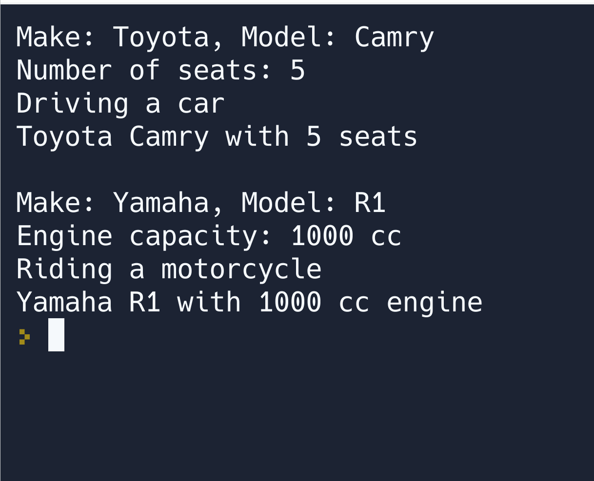

<!-- created with ChatGPT -->
<!-- Prompt:
Please create a .py file with comments explaining the code, that demonstrates these aspects of Object Oriented Programming in Python and include anything else that's relevant and fits in with the topic:
- classes
- base classes/derived classes
- sub class/super class
- abstract base classes
- decorators in Python OOP
- instance methods, instance attributed, dunder init method
- dunder methods, data model methods, magic methods
- class methods, class variables -->
<!-- Prompt:
Please give an explanation of an abstract base class vs other types of classes, and an explanation of class methods & class variables vs. instance methods & instance attributes -->

```python
# File name: oop_demo.py

# Import the `abc` module to work with abstract base classes.
import abc


# Define an abstract base class `Vehicle` using the `ABC` metaclass.
class Vehicle(abc.ABC):

    # A class variable `vehicle_count` to keep track of the number of vehicle instances.
    vehicle_count = 0

    # The constructor method (dunder init method) to initialize the instance.
    def __init__(self, make, model):
        self.make = make  # Instance attribute for the make of the vehicle.
        self.model = model  # Instance attribute for the model of the vehicle.
        Vehicle.vehicle_count += 1  # Increment the `vehicle_count` class variable.

    # An instance method to display the make and model of the vehicle.
    def display_vehicle(self):
        print(f"Make: {self.make}, Model: {self.model}")

    # A class method to display the total number of vehicle instances.
    @classmethod
    def display_vehicle_count(cls):
        print(f"Total Vehicles: {cls.vehicle_count}")

    # An abstract method to be implemented by derived classes.
    @abc.abstractmethod
    def drive(self):
        pass

    # A dunder method for a string representation of the instance.
    def __str__(self):
        return f"{self.make} {self.model}"


# Define a derived class `Car` that inherits from the base class `Vehicle`.
class Car(Vehicle):

    # A constructor method to initialize the instance.
    def __init__(self, make, model, seats):
        super().__init__(make, model)  # Call the constructor of the superclass `Vehicle`.
        self.seats = seats  # Instance attribute for the number of seats in the car.

    # An instance method to display the number of seats in the car.
    def display_seats(self):
        print(f"Number of seats: {self.seats}")

    # Implementation of the abstract method `drive` from the superclass `Vehicle`.
    def drive(self):
        print("Driving a car")

    # A dunder method for a string representation of the instance.
    def __str__(self):
        return f"{super().__str__()} with {self.seats} seats"


# Define a derived class `Motorcycle` that inherits from the base class `Vehicle`.
class Motorcycle(Vehicle):

    # A constructor method to initialize the instance.
    def __init__(self, make, model, engine_cc):
        super().__init__(make, model)  # Call the constructor of the superclass `Vehicle`.
        self.engine_cc = engine_cc  # Instance attribute for the engine capacity.

    # An instance method to display the engine capacity of the motorcycle.
    def display_engine_cc(self):
        print(f"Engine capacity: {self.engine_cc} cc")

    # Implementation of the abstract method `drive` from the superclass `Vehicle`.
    def drive(self):
        print("Riding a motorcycle")

    # A dunder method for a string representation of the instance.
    def __str__(self):
        return f"{super().__str__()} with {self.engine_cc} cc engine"


# Test the code.
if __name__ == "__main__":
    car1 = Car("Toyota", "Camry", 5)
    car1.display_vehicle()
    car1.display_seats()
    car1.drive()
    print(car1)  # Calls the `__str__` method.

    print()

    motorcycle1 = Motorcycle("Yamaha", "R1", 1000)
    motorcycle1.display_vehicle()
    motorcycle1.display_engine_cc()
    motorcycle1.drive()
    print(motorcycle1)

```



## Abstract base classes

An abstract base class (ABC) is a class that provides a common interface for its derived classes, defining a set of methods and properties that must be implemented by any concrete (non-abstract) class that inherits from it. Abstract base classes cannot be instantiated directly, meaning you cannot create an object from an abstract base class. Instead, you create objects from the concrete classes that inherit from the abstract base class and provide implementations for the abstract methods.

## Other types of classes

Regular classes (non-abstract) can be instantiated directly and may or may not provide a complete implementation for their methods. They can also serve as base classes for other classes, allowing for inheritance and polymorphism.

## Class methods & class variables

Class methods are methods that are bound to the class itself, not to any specific instance of the class. They can be called on the class directly, without the need for creating an object of the class. Class methods take a reference to the class itself as their first argument, usually named cls. Class variables are variables that are shared among all instances of a class. They are defined at the class level, outside of any method, and are usually used for storing data that is shared among all instances of the class.

## Instance methods & instance attributes

Instance methods are methods that are bound to a specific instance of a class. They can only be called on an instance of the class and are used to define the behavior of the object. Instance methods take a reference to the instance itself as their first argument, usually named self. Instance attributes are variables that are specific to each instance of the class. They are usually defined inside the constructor method (__init__) and store data that is unique to each object.
